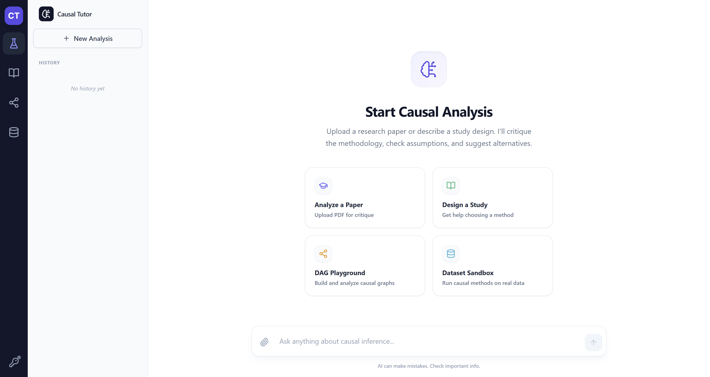

# Causal Tutor

An AI-powered teaching platform for causal inference. Helps university students rigorously understand, critique, and apply causal methods through paper analysis, an interactive curriculum, a DAG playground, and a hands-on dataset sandbox.



## 🎯 What it does

Causal Tutor is more than a chatbot. It teaches the *scientific design* of causal studies:

- **Visualizes** identification strategies as Directed Acyclic Graphs (DAGs).
- **Critiques** methodologies by surfacing unobserved confounders, weak instruments, and other threats to validity.
- **Suggests alternatives** so students think in terms of trade-offs.
- **Lets students run** real causal inference methods on real data — without writing code.

## 🚀 Features

### 🔬 Research Design Lab
- **Deep paper analysis** — upload a PDF and get a structured breakdown: causal query, identification strategy, key assumptions, threats to validity, robustness checks, and a generated DAG.
- **Scenario design** — describe a research idea in plain language and the AI designs the study (recommends a method, lists assumptions, sketches the DAG).
- **Socratic tutor chat** — streaming GPT chat scoped to the current paper/scenario, with LaTeX math, that teaches by asking questions rather than answering them.
- **Cited evidence** — every claim is backed by an exact page-number quote from the paper.

### 📚 Causality Curriculum
- **10 core methods** with full theory: DiD, IV, RDD, PSM, Synthetic Control, Front-door, RCTs, Fixed Effects, Heckman Selection, and Causal Forests.
- **Per-method DAGs** showing the identification strategy.
- **AI-generated multiple-choice exams** (3–20 questions per method) with explanations, parallel-generated for speed.

### 🧩 Interactive DAG Playground
- **Drag-and-drop canvas** for building causal DAGs (powered by React Flow). Nodes can be marked observed or latent.
- **7 example DAGs** illustrating confounding, instrumental variables, front-door criterion, Berkson's bias, M-bias, selection bias, and healthy-user bias.
- **Acyclicity validation** — cycles are rejected at edge creation time.
- **Find Paths mode** — pick two nodes, see every path between them classified as directed / backdoor / other, with collider and confounder identification.
- **D-Separation mode** — pick two nodes, then click others to add to the conditioning set; see the d-separation verdict update live.
- **Causal Analysis panel** — assign **Treatment / Outcome / Confounders** roles persistently, run a unified analysis that returns: every path with `blocked` vs `open` status and reason, the d-separation verdict, the **backdoor criterion** check (with issues if violated), and a suggested **minimal adjustment set**. Edges restyle on the canvas (emerald = open directed, rose = open backdoor, gray dashed = blocked).
- **"Check my DAG"** — GPT-powered qualitative feedback on the whole graph: plausibility, identification strategies available, faithfulness concerns, and improvement suggestions.
- **DAG Chat** — Socratic chat scoped to the current graph.

### 🧪 Dataset Sandbox
- **8 curated causal queries** spanning policy, education, healthcare, political science, psychology — sourced from CauSciBench, each with a known ground-truth effect.
- **Pick a method, pick variables, hit Run.** Supports all six methods: OLS, DiD (TWFE), IV (2SLS), RDD (local linear), Propensity Score Matching, Front-door.
- **Method switching** — try the "wrong" method and see warnings (e.g., "IV requires an instrument", "DiD requires a time variable").
- **Method-specific diagnostic plots** (Recharts):
  - *OLS* — coefficient forest plot with CIs
  - *DiD* — parallel-trends line chart + violation flag
  - *IV* — first-stage scatter + F-statistic, weak-instrument warning if F < 10
  - *RDD* — binned scatter with two local-linear fits and the cutoff line
  - *Matching* — covariate balance bars (before vs. after, with 0.1 threshold)
  - *Front-door* — T → M → Y diagram with edge coefficients and indirect/direct decomposition
- **Ground-truth comparison chip** — green if estimate falls inside the 95% CI of the known effect, amber if close, red if far off.
- **AI interpretation** — streaming GPT paragraph in plain language explaining what the estimate means, how it compares to the truth, and which assumptions are most at risk.

### 🔑 Per-user OpenAI API key
- Sidebar key icon opens a settings panel where each user saves their own OpenAI API key (stored in browser localStorage).
- Pre-flight validation against OpenAI before saving (rejects bad keys with an inline error).
- Backend rejects requests without a key (HTTP 401) and translates OpenAI auth errors into clear, actionable messages.
- Auto-opens the settings panel when any AI feature gets a 401, so users always know how to fix it.

## 🛠️ Tech Stack

- **Backend:** Python · FastAPI · OpenAI (GPT-4o) · NetworkX · statsmodels · linearmodels · scikit-learn · pandas · PyPDF
- **Frontend:** TypeScript · Next.js 14 · React 18 · Tailwind CSS · React Flow (`@xyflow/react`) · Recharts · Mermaid.js · KaTeX · Lucide
- **Infrastructure:** Docker Compose

## 🏁 Getting Started

### Prerequisites
- Docker & Docker Compose
- An OpenAI API key

### Run with Docker (recommended)

```bash
git clone https://github.com/yourusername/causal-tutor.git
cd causal-tutor
docker compose up --build
```

Then open:
- App: [http://localhost:3000](http://localhost:3000)
- API docs: [http://localhost:8000/docs](http://localhost:8000/docs)

On first launch, click the **key icon** at the bottom of the left sidebar and paste your OpenAI API key. It's saved only in your browser's localStorage and sent with each AI request.

> A `backend/.env` with `OPENAI_API_KEY=sk-...` is supported for local-dev convenience but the user-supplied key always takes precedence.

### Local development (no Docker)

```bash
# Backend
cd backend
pip install -r requirements.txt
uvicorn app.main:app --reload --port 8000

# Frontend (new terminal)
cd frontend
npm install
npm run dev
```

## 📂 Project Structure

```
CausalTutor/
├── backend/
│   ├── app/
│   │   ├── main.py                # FastAPI endpoints
│   │   ├── services.py            # Paper analysis + Socratic chat (OpenAI)
│   │   ├── dag_services.py        # NetworkX graph analysis + GPT DAG critique
│   │   ├── sandbox_services.py    # Causal estimators + LLM interpretation
│   │   ├── curriculum_data.py     # 10 core methods (theory + DAGs)
│   │   └── models.py / *_models.py
│   └── data/
│       ├── curated_queries.json   # 8 sandbox queries
│       └── synthetic_data/        # CSVs for the sandbox
└── frontend/
    └── src/
        ├── app/page.tsx           # Mode switcher (sidebar)
        ├── components/
        │   ├── CausalTutor.tsx        # Lab mode
        │   ├── CurriculumDashboard.tsx # Curriculum mode
        │   ├── DAGPlayground.tsx       # DAG playground
        │   ├── CausalAnalysisPanel.tsx # T/Y/Z roles + backdoor analysis
        │   ├── DatasetSandbox.tsx      # Sandbox mode
        │   ├── ApiKeySettings.tsx      # API key panel
        │   └── sandbox/, sandbox/plots/
        ├── lib/apiKey.ts, apiErrors.ts
        └── data/example-dags.json
```